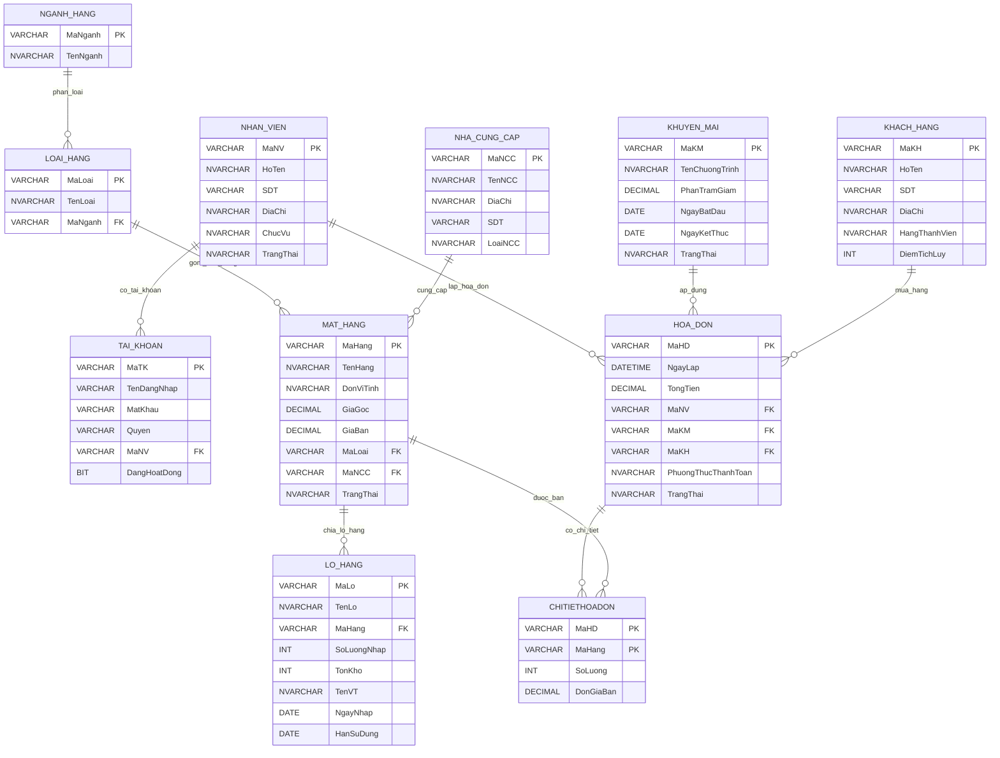

# ERD QuanLySieuThi

```mermaid
erDiagram
    NGANH_HANG {
        VARCHAR MaNganh PK
        NVARCHAR TenNganh
    }

    NHA_CUNG_CAP {
        VARCHAR MaNCC PK
        NVARCHAR TenNCC
        NVARCHAR DiaChi
        VARCHAR SDT
        NVARCHAR LoaiNCC
    }

    KHUYEN_MAI {
        VARCHAR MaKM PK
        NVARCHAR TenChuongTrinh
        DECIMAL PhanTramGiam
        DATE NgayBatDau
        DATE NgayKetThuc
        NVARCHAR TrangThai
    }

    NHAN_VIEN {
        VARCHAR MaNV PK
        NVARCHAR HoTen
        VARCHAR SDT
        NVARCHAR DiaChi
        NVARCHAR ChucVu
        NVARCHAR TrangThai
    }

    LOAI_HANG {
        VARCHAR MaLoai PK
        NVARCHAR TenLoai
        VARCHAR MaNganh FK
    }

    TAI_KHOAN {
        VARCHAR MaTK PK
        VARCHAR TenDangNhap
        VARCHAR MatKhau
        VARCHAR Quyen
        VARCHAR MaNV FK
        BIT DangHoatDong
    }

    KHACH_HANG {
        VARCHAR MaKH PK
        NVARCHAR HoTen
        VARCHAR SDT
        NVARCHAR DiaChi
        NVARCHAR HangThanhVien
        INT DiemTichLuy
    }

    MAT_HANG {
        VARCHAR MaHang PK
        NVARCHAR TenHang
        NVARCHAR DonViTinh
        DECIMAL GiaGoc
        DECIMAL GiaBan
        VARCHAR MaLoai FK
        VARCHAR MaNCC FK
        NVARCHAR TrangThai
    }

    LO_HANG {
        VARCHAR MaLo PK
        NVARCHAR TenLo
        VARCHAR MaHang FK
        INT SoLuongNhap
        INT TonKho
        NVARCHAR TenVT
        DATE NgayNhap
        DATE HanSuDung
    }

    HOA_DON {
        VARCHAR MaHD PK
        DATETIME NgayLap
        DECIMAL TongTien
        VARCHAR MaNV FK
        VARCHAR MaKM FK
        VARCHAR MaKH FK
        NVARCHAR PhuongThucThanhToan
        NVARCHAR TrangThai
    }

    CHITIETHOADON {
        VARCHAR MaHD PK
        VARCHAR MaHang PK
        INT SoLuong
        DECIMAL DonGiaBan
    }

    NGANH_HANG ||--o{ LOAI_HANG : phan_loai
    LOAI_HANG ||--o{ MAT_HANG : gom_mat_hang
    NHA_CUNG_CAP ||--o{ MAT_HANG : cung_cap
    MAT_HANG ||--o{ LO_HANG : chia_lo_hang
    NHAN_VIEN ||--o{ TAI_KHOAN : co_tai_khoan
    NHAN_VIEN ||--o{ HOA_DON : lap_hoa_don
    KHUYEN_MAI ||--o{ HOA_DON : ap_dung
    KHACH_HANG ||--o{ HOA_DON : mua_hang
    HOA_DON ||--o{ CHITIETHOADON : co_chi_tiet
    MAT_HANG ||--o{ CHITIETHOADON : duoc_ban
```
